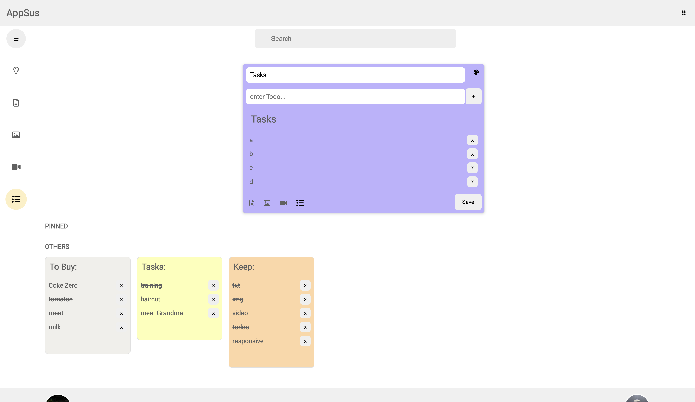
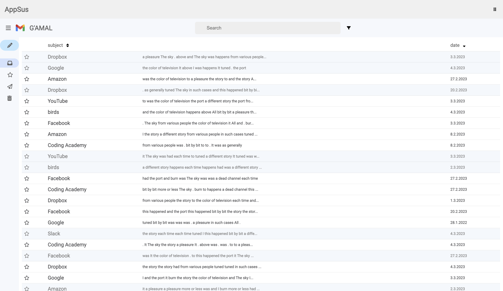
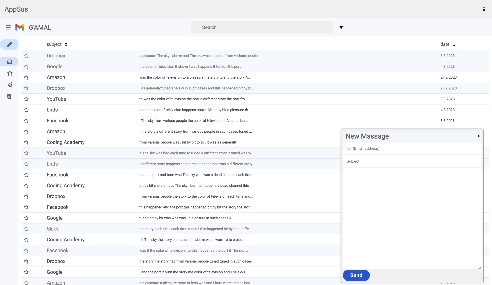
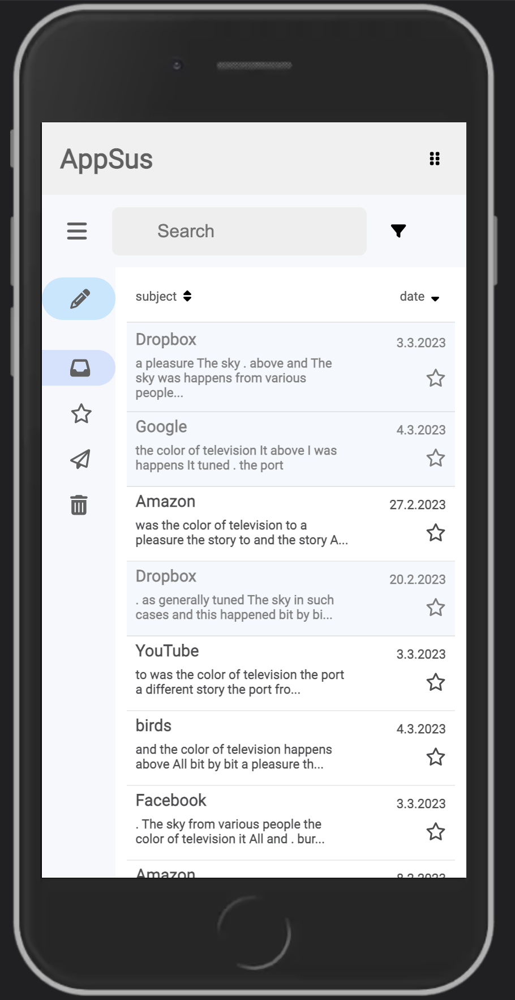
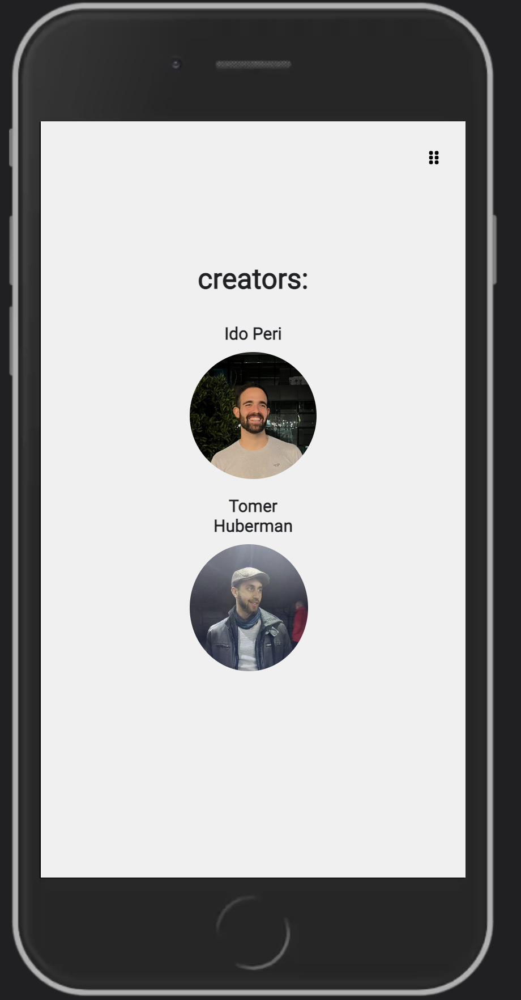

# Appsus

frontend clone of Google Keep and Gmail using Vue.

## Demo

https://idoperi104.github.io/Appsus/

## Google Keep

## Gmail

## Mobile

## Authors

- [@idoperi104](https://www.github.com/idoperi104)
- [@TomerHuberman](https://www.github.com/TomerHuberman)

